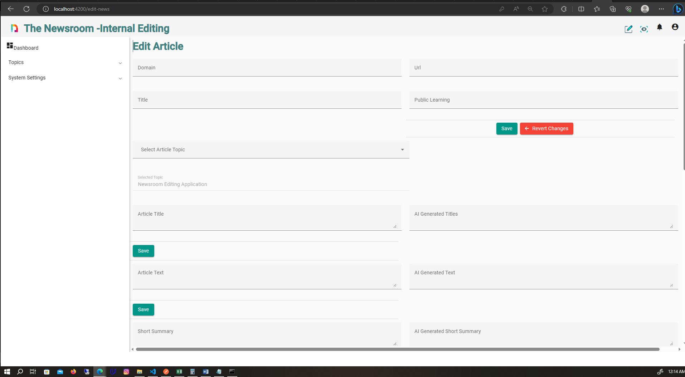

# NewsRoom
This is an application aimed to help news editing companies achieve their operational excellency by  ensuring that their
staffs have a platform where they can edit and publish news before releasing them.
The application utilizes Material Ui design system to create a more interactive components.
When posting a new  a user selects  the color for the day and that is persisted throughout the day.
The application also  has features like sorting and filtering which users can use  to search and filter the results in the manner they want.

# Login Interface 

# HomePage interface 

# Editing interface 

# Steps to run the application locally
  1. clone the application from  https://github.com/JosephKithome/The-Newsroom-.git
  2. Run npm install to  install the required libraries as per the package.json
  3. Run ng serve -o to start  the local develpment server

