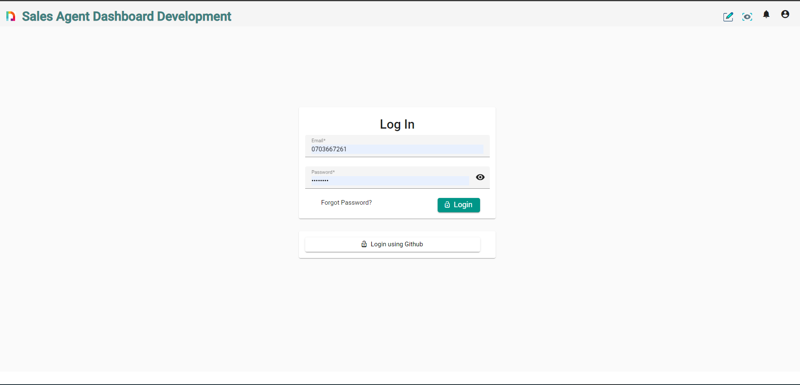
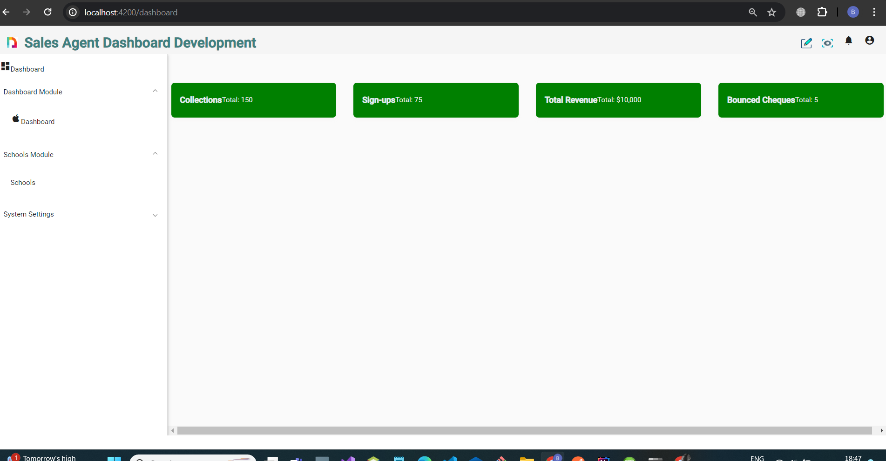
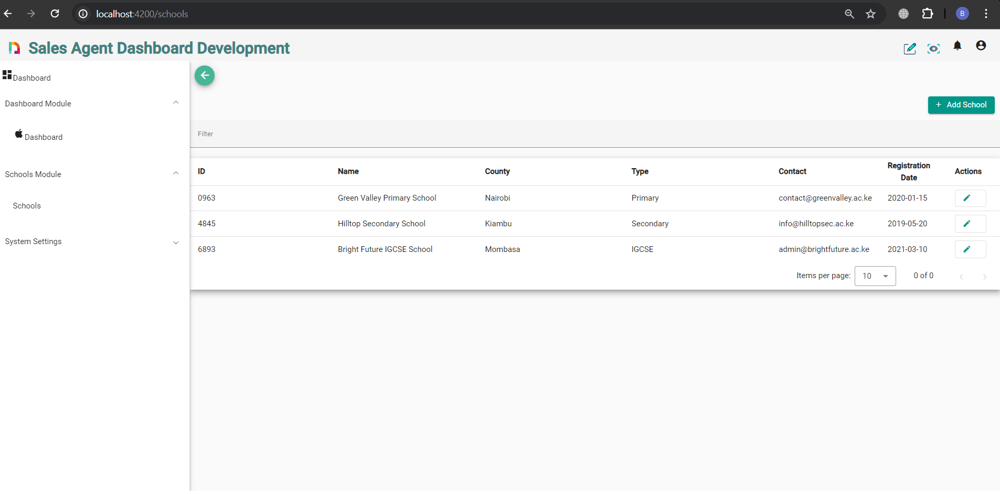
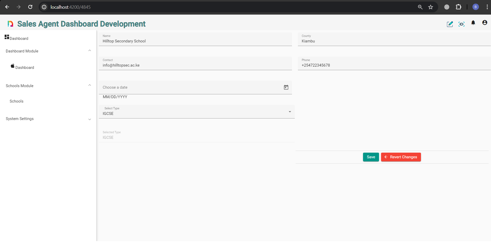

# Zeraki

# Login Interface 

# HomePage interface 

# HomePage interface 

# Editing interface 

# Steps to run the application locally
  1. clone the application from  https://github.com/buyoleisacko/zeraki-assessment.git
  2. Run npm install to  install the required libraries as per the package.json
  3. Run ng serve -o to start  the local develpment server
  4. Run npx json-server db.json for the json server to give the list of schools.

